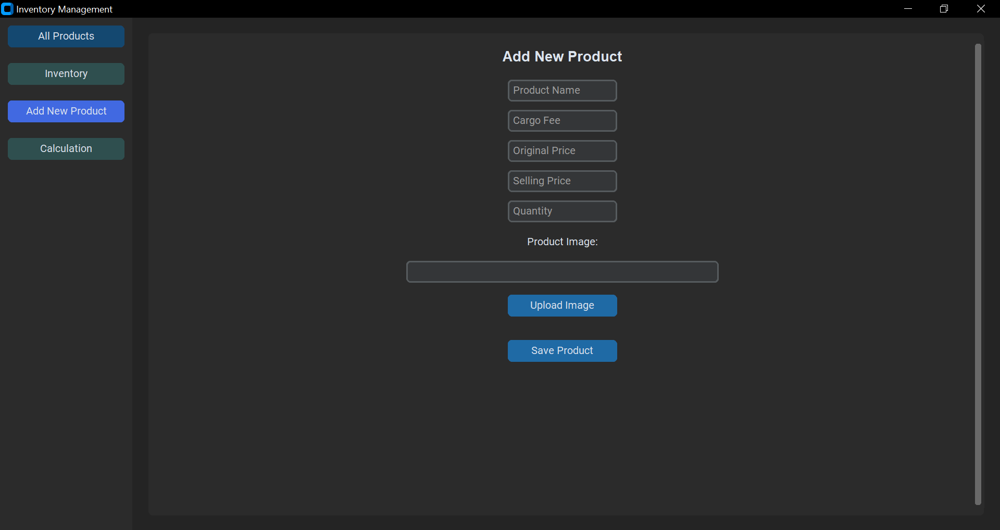

# inventory management application :

application that manages warehouse inventory. stores all product information, displays stored product information in "all products" tab, adds new product to store in "add new product" tab, manipulates stored product information and keeps track of how many of that product was sold in "inventory" tab, displays and calculates income and profit in "calculation" tab.

## menu tabs :

-all products
-inventory
-add new product
-calculation

## what each tab displays on the right:

-all products: displays all products in highlighted vertical list. each listed product horizontally shows its image, name, price and current quantity.

-inventory: displays all products in highlighted grid. each highlighted product shows its image, name, cargo fee, original price,selling price, current and original quantity, delete product button, sold button and edit product button.

-add new product: add image, add name, add cargo fee, add original price, add selling price, add quantity.

-calculation: display each product that was sold in highlighted list. each highlighted product shows name, sold quantity, original quantity, original price, cargo fee, selling price, income(sold quantity x selling price), profit(income - original quantity(original price + cargo fee))

## dependency :
-tkinter
-customtkinter
-sqlite3
-PIL

## Credits
This project was developed by [Javkhlan](https://github.com/Skitarii11) as a Personal project
